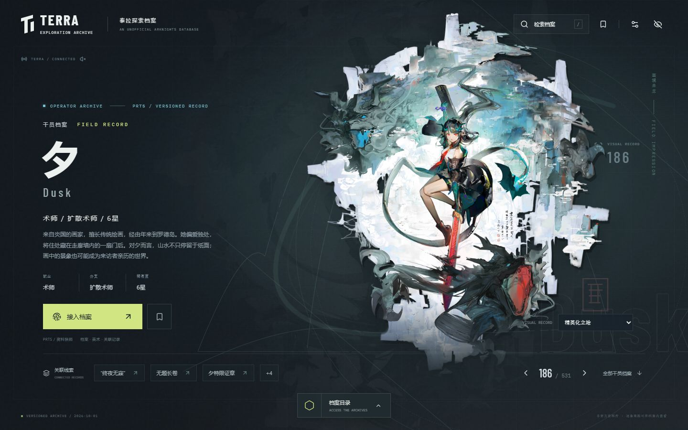
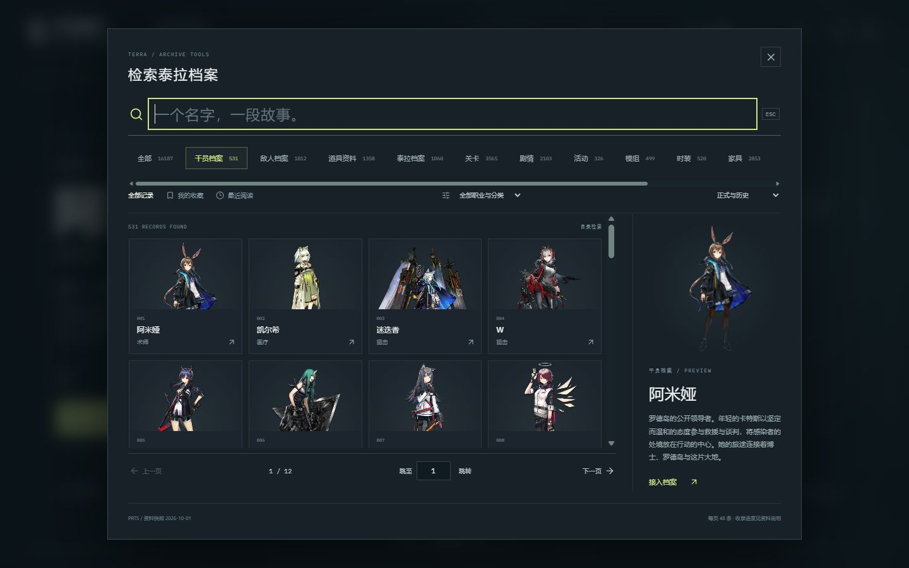
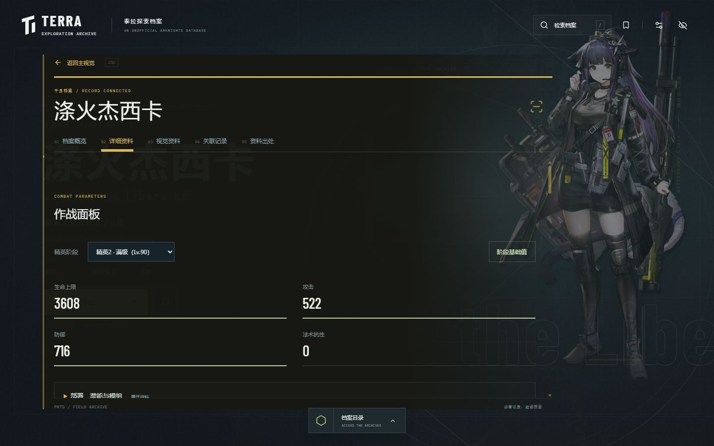
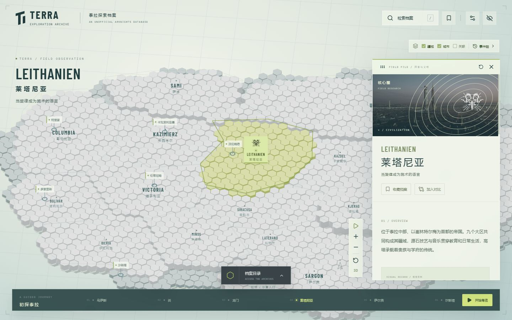
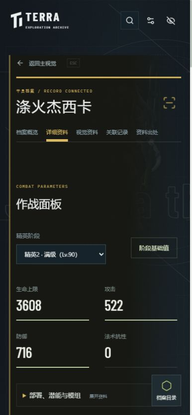

# Terra Exploration Archive

一个以《明日方舟》为主题的非官方交互资料库。以档案立绘、主舞台内联阅读、悬浮检索和可显隐界面呈现资料，在深色档案舞台与浅色泰拉地图之间探索人物、事件和地域的联系。

当前快照收录 **16,221 条记录**，覆盖干员、敌人、道具、关卡、剧情、活动、模组、时装、家具、玩法与世界观。**收录数量不代表全部内容已经整理完成**：资料仍标记为 `partial`，结构化参数、叙事提要和图片覆盖分别记录；具体缺口见档案来源页与 [覆盖报告](public/data/prts/coverage.json)。



<table>
  <tr>
    <td width="50%"><br><sub>悬浮检索与即时预览</sub></td>
    <td width="50%"><br><sub>干员属性与技能资料</sub></td>
  </tr>
  <tr>
    <td width="50%"><br><sub>地图与地区档案</sub></td>
    <td width="50%" align="center"><br><sub>移动端阅读</sub></td>
  </tr>
</table>

## 可以探索什么

- **档案舞台**：立绘版本切换、收藏、阅读足迹与关联记录。名称与简介淡出后，正文在当前主舞台展开，可查看参数、叙事提要、视觉资料及对应来源版本。
- **全库检索**：中文、英文、别名与可见正文搜索，按职业、分支、星级、敌人级别等筛选，每页 48 条，支持直接跳转页码。默认显示正式与历史资料；悬停或键盘聚焦只预览，点击才接入档案。
- **核心战斗资料**：干员精英阶段、信赖与技能等级，敌人属性级别，道具配方、关卡条件与掉落。不同形态、级别和来源缺口分别保留。
- **泰拉地图**：地区、城市与势力档案，图层、事件轴、六站导览、国家对比与可拖动情报卡。三维地图支持轻量二维回退。
- **专属视觉主题**：包含源石、雪境、深海、莱茵、光环、巴别塔、耀光、水墨、黑钢与莱塔尼亚主题。指针以平滑缓动靠近与归位，有限入场动画为阅读留出空间。
- **阅读偏好**：界面一键显隐、剧透折叠、减少动态效果与默认关闭的游戏界面音效、音量调节与试听。支持触屏与键盘操作，无账号、追踪或远程写入。

快捷键：`/` 或 `Ctrl/Cmd+K` 打开检索，`H` 显隐界面，`Esc` 关闭浮层或恢复界面。地图情报卡支持标题栏拖动、方向键微调、`Shift` 加速及 `Home` 复位。

## 快速启动（在线资料）

准备 **Node.js 22.12 或更高版本**及 npm，在终端执行：

```sh
git clone https://github.com/yi1z/TerraExplorationArchive.git
cd TerraExplorationArchive
npm ci
npm run dev
```

打开终端显示的本地地址，通常为 <http://127.0.0.1:5173/>。Windows PowerShell 若限制 `npm.ps1`，可将上述 `npm` 替换为 `npm.cmd`。

默认按需联网读取资料：中文目录、详情与检索分片固定到 GitHub 提交版本；图片按视口需要从 PRTS 或版本化精选资源加载。**无需下载约 2.58 GB 图片包**，也不在启动时重新抓取 PRTS。文字数据与图片元数据固定版本；PRTS 线上图片可能由源站更新，不等同于像素不可变的快照。

首次完整目录约 4.04 MB，图片预览按分类读取小清单。网络失败会保留已成功载入的目录，首次失败则显示 103 份精选文字档案并提供重试；未缓存的完整资料需要网络。公开云端候选与选型依据见 [在线来源评估](docs/ONLINE_SOURCES.md)。

需要断网使用时，可选择完整图片包：

```sh
npm run assets:download
npm run assets:verify
npm run dev:offline
# 或构建离线站点
npm run build:offline
npm run preview:offline
```

资源包固定为 [library-assets-2026-09-30](https://github.com/yi1z/TerraExplorationArchive/releases/tag/library-assets-2026-09-30)，下载工具校验 SHA-256 后原子安装，失败不会覆盖现有资源。源码仓库仍保留维护用当前数据快照与精选素材，在线生产构建不复制这些大目录。

## 构建与检查

```sh
npm run typecheck
npm test
npm run build
npm run preview
```

生产预览通常为 <http://127.0.0.1:4173/>。当前在线生产产物约 2.71 MB，完整资料和图像在访问时按需读取。构建产物位于 `dist/`，可用于静态托管；需通过 HTTP 服务访问，不能直接双击 `index.html`。默认在线构建无需完整图片包；离线构建前应先安装。`npm run validate` 会依次执行类型检查、测试与生产构建。

开发服务器可直接读取启动后新生成的数据与图片；更新完成后手动刷新页面即可。生产预览读取已构建的文件，更新资源后须重新构建。

## 资料维护与本地记录

资料是手动更新的 PRTS 快照，在线版本额外由 [online-release.json](resources/online-release.json) 固定，当前版本以 [manifest.json](public/data/prts/manifest.json) 为准。剧情和社区整理保留来源性质，未核验内容明确标记；完整剧本、长篇档案原文及原图缓存不随仓库发布。地图边界、坐标与地形高度用于导航示意。

收藏、足迹和偏好保存在当前浏览器，开发与生产地址的端口不同，记录也相互独立。原有档案 ID 与地图链接保持兼容，例如 `#/archive?entry=operator-amiya`、`#/atlas?entry=lungmen`。没有云同步；旧版迁移与存储回退边界见 [本地存储说明](docs/LIBRARY.md#浏览器读取)。

普通运行与构建**不需要下载 PRTS 原始页面**。维护者执行 `npm run prts:thumbnails` 查询真实缩略图地址，再用 `npm run prts:online` 生成在线目录；先提交发布资料，核验公开 URL 后，再把其提交 SHA 写入在线版本清单。重新发现来源、增量同步、离线重建资料及原图核验属于维护者流程，依赖未提交的本地缓存，详见 [资料与资源维护](docs/LIBRARY.md)。

## 当前覆盖情况

当前快照为 `prts-2026-10-01T01-46-17-615Z`。来源收录、参数整理、叙事提要与图片覆盖分别统计：

| 范围       | 当前状态                                                                                            |
| ---------- | --------------------------------------------------------------------------------------------------- |
| 目录收录   | 16,221 条记录；含 531 份干员／召唤物、1,812 份敌人、1,392 份道具、3,565 份关卡与 2,103 份剧情／密录 |
| 参数与索引 | 14,348 条已整理、813 条待补、1,060 条不适用                                                         |
| 叙事待补   | 708 篇剧情／密录提要、159 个世界观摘要、24 份无源干员履历                                           |
| 图片关联   | 13,447 条有图、2,776 条未找到可用关联图；此统计包含两个兼容别名                                     |

图片包同时保留来源元数据和已知缺图记录。完整收录来源页面不等于已整理全部正文；动态活动规则、任务解锁连线等仍有待补范围，以 [覆盖报告](public/data/prts/coverage.json) 和站内来源面板为准。

## 技术与文档

React · TypeScript · Vite · Three.js / React Three Fiber · Zustand · Web Worker · IndexedDB

- [资料快照、图片包与维护流程](docs/LIBRARY.md)
- [内容结构](docs/DATA_GUIDE.md) · [动效设计](docs/MOTION.md)
- [来源、署名与许可记录](docs/THIRD_PARTY.md)
- [本轮资料抽查与待补](docs/DATA_REVIEW.md)
- [实际验证记录](docs/VERIFICATION.md) · [软件依赖许可通知](public/third-party-notices.txt)

本项目为非官方资料整理与互动设计，与鹰角网络无隶属关系。《明日方舟》的游戏美术、文本、世界设定和商标归原权利人；PRTS 托管不代表这些素材获得开放许可。社区资料按来源声明保留署名与适用许可，具体见 [来源与许可记录](docs/THIRD_PARTY.md)。
